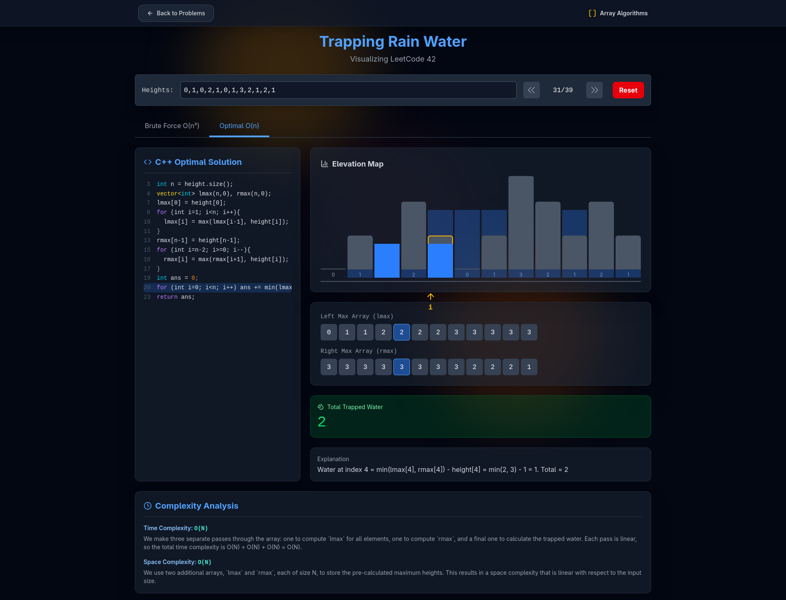

# 🎨 AlgoVisualizer

<div align="center">


**An Interactive Web Platform for Visualizing Algorithms and Data Structures**

[](https://algo-visualizer-green.vercel.app/)
[](https://reactjs.org/)
[](https://vitejs.dev/)
[](LICENSE)
[](https://hacktoberfest.com/)

[Live Demo](https://algo-visualizer-green.vercel.app/) • [Report Bug](https://github.com/mahaveergurjar/AlgoVisualizer/issues) • [Request Feature](https://github.com/mahaveergurjar/AlgoVisualizer/issues)

</div>

---

- ✅ Bubble Sort (Implemented)
- ✅ Merge Sort (Implemented)
- ✅ Quick Sort (Implemented)
- 🔄 Selection Sort (Coming Soon)
- 🔄 Insertion Sort (Coming Soon)
- 🔄 Heap Sort (Coming Soon)
- 🔄 Counting Sort (Coming Soon)
- 🔄 Radix Sort (Coming Soon)

**AlgoVisualizer** is a modern, interactive web application designed to help students, developers, and algorithm enthusiasts understand complex Data Structures and Algorithms (DSA) through visual, step-by-step execution. Whether you're preparing for technical interviews, studying for exams, or simply curious about how algorithms work under the hood, AlgoVisualizer makes learning engaging and intuitive.

### ✨ Why AlgoVisualizer?

- 🎯 **Visual Learning**: See algorithms in action with real-time, animated visualizations
- 🚀 **Interactive Controls**: Adjust speed, pause, and step through algorithms at your own pace
- 🎨 **Modern UI**: Clean, responsive interface built with React and Tailwind CSS
- 📚 **Comprehensive Coverage**: From basic sorting to advanced pathfinding algorithms
- 🔧 **Educational Focus**: Perfect for students, teachers, and self-learners
- 💻 **No Installation**: Run directly in your browser

---

- **Interactive Controls**:
  - Step-by-step algorithm visualization
  - Interactive forward/backward navigation
  - Real-time complexity metrics (comparisons, swaps, merges)
  - Educational explanations for each step
  - Keyboard navigation support (arrow keys)
  - Visual representation of algorithm steps

---

## 🛠️ Built With

<div align="center">

| Technology                                                                                                        | Description                        |
| ----------------------------------------------------------------------------------------------------------------- | ---------------------------------- |
|                   | Frontend framework for building UI |
|                      | Fast build tool and dev server     |
|  | Utility-first CSS framework        |
|    | Programming language               |
|                | Deployment platform                |

</div>

---

## 📁 Project Structure

```
AlgoVisualizer/
├── public/                  # Static assets
│   └── vite.svg            # Vite logo
├── src/                    # Source files
│   ├── components/         # React components
│   │   ├── Sorting/       # Sorting algorithm components
│   │   ├── Pathfinding/   # Pathfinding components
│   │   ├── Graph/         # Graph algorithm components
│   │   └── UI/            # Reusable UI components
│   ├── algorithms/         # Algorithm implementations
│   │   ├── sorting/       # Sorting algorithm logic
│   │   ├── pathfinding/   # Pathfinding algorithm logic
│   │   └── graph/         # Graph algorithm logic
│   ├── utils/             # Utility functions
│   │   ├── helpers.js     # Helper functions
│   │   └── constants.js   # App constants
│   ├── styles/            # CSS modules and styles
│   │   └── *.module.css   # Component-specific styles
│   ├── App.jsx            # Main App component
│   ├── App.css            # Global styles
│   ├── main.jsx           # Entry point
│   └── index.css          # Base CSS
├── .gitignore             # Git ignore rules
├── index.html             # HTML template
├── package.json           # Dependencies and scripts
├── vite.config.js         # Vite configuration
└── README.md              # Project documentation
```

---

## 🚀 Getting Started

### Prerequisites

Before you begin, ensure you have the following installed:

- **Node.js** (v14.0 or higher)
- **npm** (v6.0 or higher) or **yarn**

### Installation

1. **Clone the repository**

   ```bash
   git clone https://github.com/mahaveergurjar/AlgoVisualizer.git
   cd AlgoVisualizer
   ```

2. **Install dependencies**

   ```bash
   npm install
   # or
   yarn install
   ```

3. **Start the development server**

   ```bash
   npm run dev
   # or
   yarn dev
   ```

4. **Open your browser**

   Navigate to [http://localhost:5173](http://localhost:5173) to view the application.

### Build for Production

```bash
npm run build
# or
yarn build
```

The optimized production build will be generated in the `dist/` folder.

---

## 💡 Usage

### Sorting Visualizer

1. Select a sorting algorithm from the dropdown menu
2. Adjust the array size and speed using the sliders
3. Click "Generate New Array" to create random data
4. Press "Start" to begin the visualization
5. Use "Pause/Resume" to control the execution
6. Click "Reset" to return to the initial state

### Pathfinding Visualizer

1. Choose between Dijkstra's or A\* algorithm
2. Click on the grid to set walls/obstacles
3. Set start and end points
4. Adjust visualization speed
5. Click "Visualize" to see the algorithm in action

### Graph Algorithms

1. Select DFS or BFS
2. Click nodes to create a graph structure
3. Choose a starting node
4. Watch the traversal process unfold

---

## 🤝 Contributing

We welcome contributions from developers of all skill levels! Whether it's fixing bugs, adding features, improving documentation, or suggesting ideas, your help is appreciated.

### How to Contribute

1. **Fork the repository**

   ```bash
   git clone https://github.com/YOUR-USERNAME/AlgoVisualizer.git
   ```

2. **Create a feature branch**

   ```bash
   git checkout -b feature/AmazingFeature
   ```

3. **Make your changes**

   - Write clean, readable code
   - Follow the existing code style
   - Add comments where necessary
   - Test your changes thoroughly

4. **Commit your changes**

   ```bash
   git commit -m 'Add some AmazingFeature'
   ```

5. **Push to your branch**

   ```bash
   git push origin feature/AmazingFeature
   ```

6. **Open a Pull Request**
   - Provide a clear description of your changes
   - Reference any related issues
   - Wait for review and feedback

### Contribution Guidelines

- ✅ Ensure your code follows the project's coding standards
- ✅ Write meaningful commit messages
- ✅ Test your changes before submitting
- ✅ Update documentation if needed
- ✅ Be respectful and constructive in discussions
- ✅ Follow the standard visualization layout (see below)
- ❌ Don't submit spam or low-quality PRs

### 📐 Standard Visualization Layout Structure

**All algorithm visualizations must follow this consistent layout for a uniform user experience:**

```
┌─────────────────────────────────────────────────────────────┐
│  HEADER SECTION                                             │
│  - Problem Title (e.g., "Trapping Rain Water")              │
│  - Problem Description/LeetCode Number                      │
│  - Back to Problems Button                                  │
└─────────────────────────────────────────────────────────────┘

┌─────────────────────────────────────────────────────────────┐
│  INPUT CONTROLS ROW                                         │
│  - Input Field (for array/data input)                       │
│  - Navigation Controls (Previous/Next Step)                 │
│  - Step Counter (e.g., "31/39")                             │
│  - Reset Button                                             │
└─────────────────────────────────────────────────────────────┘

┌─────────────────────────────────────────────────────────────┐
│  ALGORITHM TABS (if multiple approaches)                    │
│  - Brute Force O(n²)                                        │
│  - Optimal O(n)                                             │
└─────────────────────────────────────────────────────────────┘

┌──────────────────────────┬──────────────────────────────────┐
│  LEFT PANEL              │  RIGHT PANEL                     │
│                          │                                  │
│  CODE SECTION            │  VISUALIZATION SECTION           │
│  - Syntax highlighted    │  - Main visual representation    │
│  - Line numbers          │  - Interactive bars/nodes/graph  │
│  - Current line highlight│  - Color-coded elements          │
│  - Step-by-step execute  │  - Animated transitions          │
│                          │  - Current position indicator    │
└──────────────────────────┴──────────────────────────────────┘

┌─────────────────────────────────────────────────────────────┐
│  DATA STRUCTURE DISPLAY (if applicable)                     │
│  - Arrays/Stacks/Queues being used                          │
│  - Show values at each step                                 │
│  - Highlight active elements                                │
│  Example:                                                   │
│    Left Max Array (lmax):  [0, 1, 1, 2, 2, 2, ...]          │
│    Right Max Array (rmax): [3, 3, 3, 3, 3, 2, ...]          │
└─────────────────────────────────────────────────────────────┘

┌─────────────────────────────────────────────────────────────┐
│  OUTPUT SECTION                                             │
│  - Final result display                                     │
│  - Clear visual indicator                                   │
│  Example: "Total Trapped Water: 6"                          │
└─────────────────────────────────────────────────────────────┘

┌─────────────────────────────────────────────────────────────┐
│  EXPLANATION SECTION                                        │
│  - Step-by-step explanation of current operation            │
│  - Formula/logic being applied                              │
│  Example: "Water at index 4 = min(max[4], rmax[4])          │
│            - height[4] = min(2, 3) - 1 = 1"                 │
└─────────────────────────────────────────────────────────────┘

┌─────────────────────────────────────────────────────────────┐
│  COMPLEXITY ANALYSIS                                        │
│  - Time Complexity: O(n) with explanation                   │
│  - Space Complexity: O(n) with explanation                  │
│  - Brief description of approach                            │
└─────────────────────────────────────────────────────────────┘
```

### 🎨 Implementation Guidelines

When creating a new visualization, ensure you include:

1. **Header Section**

   - Clear problem title
   - Subtitle with problem number or description
   - Navigation back to problem list

2. **Input Controls**

   - Input field for custom data entry
   - Play/Pause button for animation
   - Step forward/backward buttons (◄ ►)
   - Speed control slider
   - Reset button to start over
   - Step counter showing progress

3. **Code Display** (Left Panel)

   - Syntax-highlighted code
   - Line numbers
   - Current executing line highlighted
   - Support for multiple language tabs (C++, Java, Python)

4. **Visualization Area** (Right Panel)

   - Main visual representation (bars, nodes, grid, etc.)
   - Smooth animations between states
   - Color coding:
     - `Blue` - Currently processing
     - `Green` - Completed/correct
     - `Red` - Comparison/error
     - `Yellow/Gold` - Special focus
     - `Gray` - Default/unprocessed
   - Clear labels and indices

5. **Data Structure Display**

   - Show auxiliary arrays/stacks/queues if used
   - Display current values
   - Highlight active elements
   - Update in sync with main visualization

6. **Output Section**

   - Large, clear display of final result
   - Use success color (green) for completion
   - Include units or context

7. **Explanation Panel**

   - Dynamic text explaining current step
   - Show formulas or calculations
   - Update with each step
   - Keep it concise and clear

8. **Complexity Analysis**
   - Time complexity with Big-O notation
   - Space complexity with Big-O notation
   - Brief explanation of why
   - Comparison with other approaches if applicable

### 📋 Component Checklist

Before submitting your visualization, ensure:

- [ ] Follows the standard layout structure
- [ ] Includes all required sections
- [ ] Code is properly syntax highlighted
- [ ] Animations are smooth and not too fast/slow
- [ ] Colors are consistent with the design system
- [ ] Responsive design works on different screen sizes
- [ ] Input validation handles edge cases
- [ ] Step-by-step navigation works correctly
- [ ] Explanation text is clear and educational
- [ ] Complexity analysis is accurate
- [ ] Code is well-commented
- [ ] No console errors or warnings

### 🎃 Hacktoberfest

This project participates in [Hacktoberfest](https://hacktoberfest.com/)! We encourage quality contributions during October and throughout the year.

---

## 📸 Screenshots

### Example: Trapping Rain Water Visualization

The visualization follows our standard layout with:

- Input controls at the top
- Code visualization on the left
- Interactive elevation map on the right
- Data structure displays (lmax, rmax arrays)
- Real-time output and step explanations
- Complexity analysis at the bottom

<div align="center">
  
  <p><i>Standard layout showing all required components</i></p>
</div>

> Add more screenshots of your visualizations here

---

## 🎓 Learning Resources

Want to learn more about the algorithms visualized in this project?

- [Big-O Cheat Sheet](https://www.bigocheatsheet.com/)
- [VisuAlgo](https://visualgo.net/)
- [GeeksforGeeks - Algorithms](https://www.geeksforgeeks.org/fundamentals-of-algorithms/)
- [Introduction to Algorithms (CLRS)](https://mitpress.mit.edu/books/introduction-algorithms-third-edition)

---

## 🐛 Known Issues

- No known critical issues at this time
- Report bugs via [GitHub Issues](https://github.com/mahaveergurjar/AlgoVisualizer/issues)

---

## 📜 License

Distributed under the MIT License. See `LICENSE` file for more information.

---

## 👨‍💻 Author

**Mahaveer Gurjar**

- GitHub: [@mahaveergurjar](https://github.com/mahaveergurjar)
- Project Link: [https://github.com/mahaveergurjar/AlgoVisualizer](https://github.com/mahaveergurjar/AlgoVisualizer)

---

## 🙏 Acknowledgments

- Inspired by the need for better algorithm education tools
- Thanks to all contributors who have helped improve this project
- Built with ❤️ for the developer community

---

## 📊 Project Stats


---

## 🧑‍💻 Run the Project Locally (Beginner Friendly)

If you're contributing for the first time (like during Hacktoberfest 🎃), follow these simple steps to set up **AlgoVisualizer** locally:

```bash
# 1️⃣ Fork this repository (click 'Fork' on GitHub)
# 2️⃣ Clone your fork
git clone https://github.com/<your-username>/AlgoVisualizer.git

# 3️⃣ Navigate into the project folder
cd AlgoVisualizer

# 4️⃣ Install required dependencies
npm install

# 5️⃣ Start the local development server
npm run dev

Now open your browser and go to 👉 http://localhost:5173

to explore the app locally!
```
---

<div align="center">

**If you find this project helpful, please consider giving it a ⭐!**

Made with 💻 and ☕ by developers, for developers.

</div>
